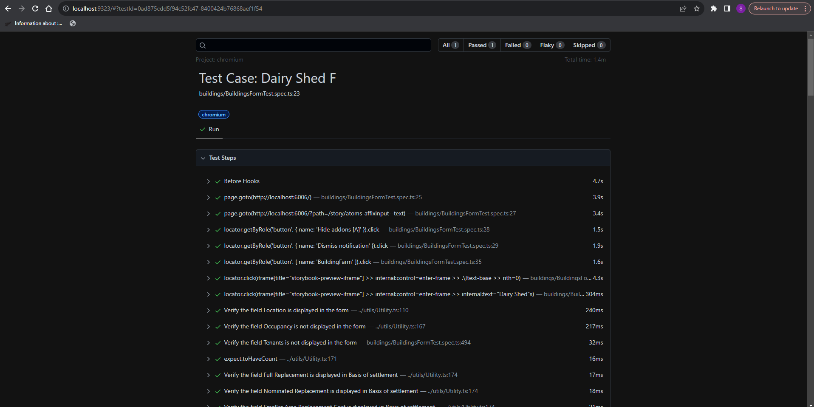
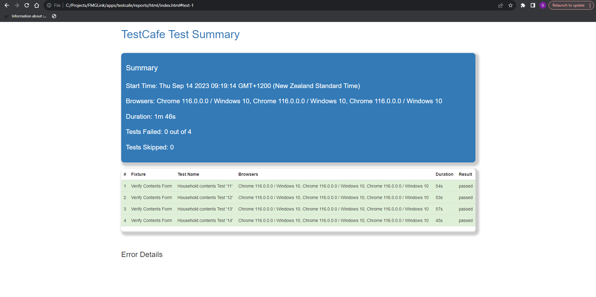

# FMG Link Monorepo


### Component Testing 
This repo has got two testing framework 
1. Playwright
2. TestCafe


### Project structure
```
Link
    apps
        |
        playwright
            |
            data
                |
                +-- BuildingForm.csv
            |
            reports
            |
            tests
                |
                buildings
                    |
                    +-- BuildingsFormTest.spec.ts
        testcafe
            |
            data
                |
                +-- SampleFile.json
            pages
                |
                +-- ContentsPage.js
                +-- HomePage.js
            |
            reports
            |
            tests
                |
                +-- ContentsForm.test.ts
```

Soon one of the testing framework will be finalised by FMG.

### Steps to Start the local DEV server

As a pre-requisite clone this repo to your local machine and navigate to the location mentioned below

cd <projecthome>\apps\web

Command to start the DEV server 

pnpm dev


### To start Story book
Testing framework expects Story book running before executing the test 

Navigate to the location mentioned below

cd <projecthome>\apps\docs

Command to start storybook

pnpm storybook


### To run playwright test scripts

Navigate to the location 

cd <projecthome>\apps\playwright

The below command execute the playwright test script on two Chrome browsers in parallel

pnpm exec playwright test BuildingsFormTest.spec.ts --project=chromium --headed --workers 2

### Test Report for playwright

Test reports are generated in cd <projecthome>\apps\playwright\reports




### To run TestCafe test scripts

Navigate to the location 

cd <projecthome>\apps\testcafe

The below command execute the testcafe test script on two Chrome browsers in parallel

pnpm run test:reports


### Test Report for playwright

Test reports are generated in cd <projecthome>\apps\testcafe\reports




### Lookup-Data JSON

The "lookup-data.json" file serves to validate the options within Radio button fields. However, relying solely on this file can potentially lead to inaccurate test results. To mitigate this risk, it's advisable to make a copy of the file in the "/testcafe/data" directory once it's been approved in a specific version. This precautionary step helps prevent regression problems from arising.